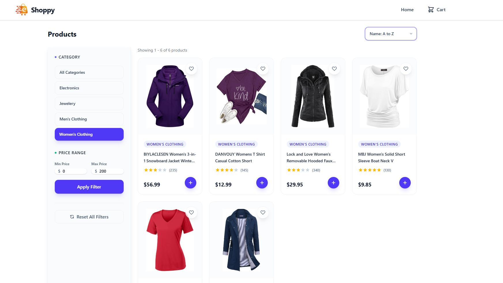
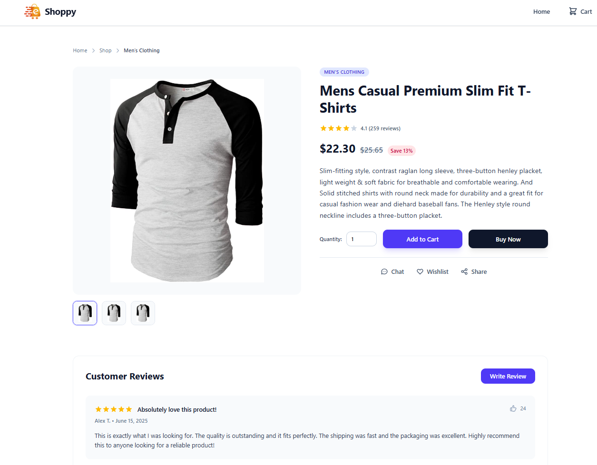
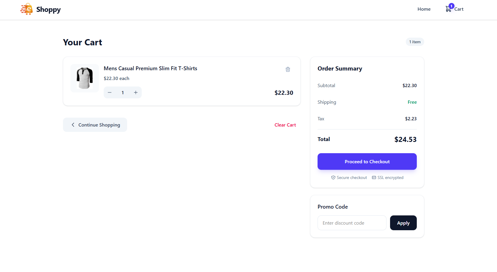

# Shoppy - Modern E-commerce App

A sleek, responsive e-commerce web application built with React and Tailwind CSS.

Live Url - [https://shoppy-ecommerce-henna.vercel.app/](https://shoppy-ecommerce-henna.vercel.app/)





## Features

- Modern UI with Tailwind CSS
- Fully responsive design
- Shopping cart functionality
- Product filtering & sorting
- Detailed product pages
- Fast performance

## Quick Setup

```bash
# Clone the repository
git clone https://github.com/imjacobrajan/shoppy-ecommerce.git
cd shoppy-ecommerce

# Install dependencies
npm install

# Start development server
npm start
```

Open [http://localhost:3000](http://localhost:3000) in your browser.

Built by [imjacobrajan](https://github.com/imjacobrajan)
